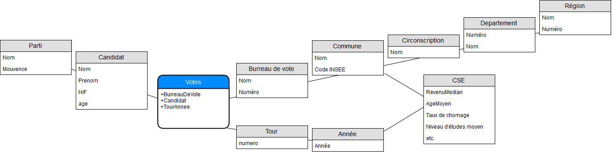

# Projet NF26
## Guillaume JORANDON, Aiman Zaki

# Modélisation du problème

Pour modéliser le data-warehouse, nous avons décidé de considérer d'abord trois dimensions d'une modélisation en étoile :
* Spatiale : découpage géographique à toutes les granularités disponibles (bureau de vote, commune, etc.) ;
* Temporelle : découpage temporelle en tours et années ;
* Politique : découpage politique à toutes les granularités disponibles (candidat, parti, et éventuellement bord politique gauche/droite).

La table de faits stocke alors le nombre de votes pour un candidat donné. Deux problèmes se posent alors dans la modélisation. D'une part, comment compter les votes blancs, nuls, et l'abstention ? D'autre part, comment prendre en compte les critères socio-économiques ?

Pour le premier problème, on le résout assez simplement en considérant Mr. (votes blancs), Mr. (votes nuls) et Mme. (abstention) comme des candidats. En revanche, il est difficile de répondre au deuxième problème avec une modélisation en étoile classique. En effet, on a vu sur le site de l'INSEE que les critères socio-économiques sont répertoriés par emplacement géographique (la plus fine granularité est la commune) et par année. On décide donc de s'écarter un peu de la modélisation en étoile en ajoutant une entité "CSE", à cheval sur les dimensions temporelle et spatiale. On obtient ainsi la modélisation ci-dessous.

TODO : ajouter le tour au découpage temporel.

